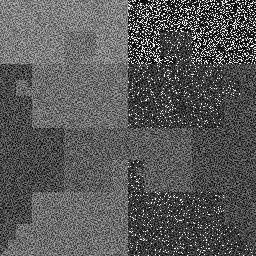
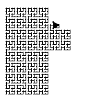

# **Bertrand (180 pts) 21 solves**
Bertrand stands tall as the epitome of security, safeguarding images with an impenetrable fortress of encryption that leaves no room for compromise.

## **Description**
We are given an image `enc.png` and a python script called `Bertrand.py`. The image looks like this.



And this is the raw `Bertrand.py` script.
```py
#!/usr/bin/env python3
import sys
import math
import functools
from PIL import Image
from random import randint
import string
from secret import flag, key, n

def pad(s, l):
        while len(s) < l:
                s += string.printable[randint(0, 61)]
        return s

def sox(n, d):
        x, y, t = 0, 0, d
        for s in range(n - 1):
                u = 1 & t // 2
                v = 1 & t ^ u
                x, y = spin(2**s, x, y, u, v)
                x += 2**s * u
                y += 2**s * v
                t = t // 4
        return x, y

def spin(n, x, y, u, v):
        if v == 0:
                if u == 1:
                        x = n - 1 - x
                        y = n - 1 - y
                x, y = y, x
        return x, y

def encrypt(msg, key, n):
        _msg = pad(msg, n ** 2)
        _msg, _key = [ord(_) for _ in _msg], [ord(_) for _ in key]
        img = Image.new('RGBA', (n, n), 'darkblue')
        pix = img.load()

        for _ in range(len(key)):
                w = len(_key)
                h = n**2 // w + 1
                arr = [[_msg[w*x + y] if w*x + y < n**2 else None for x in range(h)] for y in range(w)]
                _conf = sorted([(_key[i], i) for i in range(w)])
                _marshal = [arr[_conf[i][1]] for i in range(w)]
                _msg = functools.reduce(lambda a, r: a + _marshal[r], range(w), [])
                _msg = list(filter(lambda x: x is not None, _msg))
                _msg = [(_msg[_] + _key[_ % w]) % 256 for _ in range(n**2)]

        for d in range(n**2):
                x, y = sox(n, d)
                pix[x,y] = (_msg[d], _msg[d], _msg[d])
        keysum = sum(_key) if w > 0 else 0
        orient = keysum % 4
        img = img.rotate(90*orient)
        return img

assert len(key) == 3
img = encrypt(flag, key, n)
img.save('enc.png')
```

There seems to be alot going in this script. First off, we can see that there is a flag and a key. The key is some string of length 3, and the flag is then "encrypted" with this key and saved to an image called `enc.png`. 

The encrypt function first pads the message to be of length `n**2`. We can later see from the actual image creation and by just guessing, that `n**2` notes the number of pixels in the image. Meaning since the image is `256 x 256` pixels, then `n = 256`.
```py
_msg = pad(msg, n ** 2)
```

The pad function just fills the message with a bunch of random printable characters, pretty straightforward.
```py
def pad(s, l):
        while len(s) < l:
                s += string.printable[randint(0, 61)]
        return s
```

It then operates on the integer values of the message and the key, as a list. We can note that `_msg` will be of length `n**2 = 256**2` and `_key` is of length `3`.
```py
_msg, _key = [ord(_) for _ in _msg], [ord(_) for _ in key]
```

As for the actual encryption, we seem to perform 3 rounds involving grouping certain characters, permuting the group, recombining the groups, then performing a simple `vignere` cipher.

First we get group the charecters by their index equal to `0 (mod 3)`, `1 (mod 3)` and `2 (mod 3)`. 
```py
arr = [[_msg[w*x + y] if w*x + y < n**2 else None for x in range(h)] for y in range(w)]
```

We then permute these groups based on the ascii order of the key.
```py
_conf = sorted([(_key[i], i) for i in range(w)])
_marshal = [arr[_conf[i][1]] for i in range(w)]
_msg = functools.reduce(lambda a, r: a + _marshal[r], range(w), [])
_msg = list(filter(lambda x: x is not None, _msg))
```

And a vignere cipher is then performed on the modified message and the key.
```py
_msg = [(_msg[_] + _key[_ % w]) % 256 for _ in range(n**2)]
```

Finally, the message is placed as the (r, g, b) value of each pixel in the image based on the `sox()` function, and the image is rotated some amount based on the key.
```py
for d in range(n**2):
        x, y = sox(n, d)
        pix[x,y] = (_msg[d], _msg[d], _msg[d])
keysum = sum(_key) if w > 0 else 0
orient = keysum % 4
img = img.rotate(90*orient)
return img
```

## **Solution**
We can eliminate a few parts of the code and notice a few important and useful aspects of this encryption in order to simplify the solving process. 

First, since the image is rotated some amount, but the amount is always a multiple of `90`, we simply ignore that and later try all 4 possible rotations of the `enc.png` image.

Next, what is the `sox` function? I had no idea what the code was trying to do, so instead I decided to draw it.

```py
def sox(n, d):
	x, y, t = 0, 0, d
	for s in range(n - 1):
		u = 1 & t // 2
		v = 1 & t ^ u
		x, y = spin(2**s, x, y, u, v)
		x += 2**s * u
		y += 2**s * v
		t = t // 4
	return x, y

def spin(n, x, y, u, v):
	if v == 0:
		if u == 1:
			x = n - 1 - x
			y = n - 1 - y
		x, y = y, x
	return x, y

n = 256
def gen():
    for i in range(n**2):
        yield sox(n, i)
	
import turtle

def draw_path(_, square_size):
    screen = turtle.Screen()
    screen.setup(800, 800)

    turtle.penup()
    turtle.speed(0)

    for point in gen():
        x = point[0] * square_size + square_size / 2
        y = point[1] * square_size + square_size / 2

        off = 10 * square_size
        turtle.goto(x - off, y - off)
        turtle.pendown()
        turtle.dot(2)

    turtle.hideturtle()
    turtle.done()

draw_path(..., 4)
```

It immediately becomes quite clear that it's a Hilbert curve, a 2d space filling curve, or a unique map from a number to a 2d point. The main usefulness of this knowledge is that we can assume the image pixels have a one-to-one (therefore invertable) mapping to the message.




The next observation is that the positions of bits in the initial message, and the final message will always be the same **if** the confusion permutation is the same. This is clear since the ascii ordering of the key is the only thing that affects the order of the bits. The operations otherwise will be the same regardless of the message. 

Finally, we know that the same index of the key will always affect the same character of the message in each round of the encryption. This with the above information tells us that we can do a known plaintext attack to figure out the original message. We can test each 6 possible permutations and 4 possible image rotations to try and recover the key. 

To figure out how the confusion array and key affect an input, I modified the encrypt function like so.
```py
def do(n, msg, key, sl=None):
	_msg = padd(msg, n**2, '\0')
	_msg, _key = [ord(_) for _ in _msg], [ord(_) for _ in key]
	for _ in range(len(key)):
		w = len(_key)
		h = n**2 // w + 1
		arr = [[_msg[w*x + y] if w*x + y < n**2 else None for x in range(h)] for y in range(w)]

		if not sl:
			_conf = sorted([(_key[i], i) for i in range(w)])
		else:
			_conf = sorted([(_key[i], i, sl[i]) for i in range(w)], key=lambda x: x[2])

		_marshal = [arr[_conf[i][1]] for i in range(w)]
		_msg = functools.reduce(lambda a, r: a + _marshal[r], range(w), [])
		_msg = list(filter(lambda x: x is not None, _msg))
		_msg = [(_msg[_] + _key[_ % w]) % 256 for _ in range(n**2)]

	return _msg
```

This can then be used like this to get alot of information needed to solve a particular permutation case.

```py
n = 256
msg = 'ABCDE'

TEMP = '\1\2\3'
baseline = do(n, msg, '\0\0\0', TEMP)
base = []
l = []
for i, v in enumerate(baseline):
	if v > 1:
		base.append((i, chr(v)))
		l.append(i)
print(base)
print(l)
print('------------------------')
diffs = []

for key in ['\x00\x00\x00', '\x00\x00\x01', '\x00\x01\x00', '\x01\x00\x00']:
	n = 256
	msg = 'CCTF{'

	baseline = do(n, msg, key, TEMP)
	idk = [baseline[i] for i in l]
	print(idk)

	diffs.append(idk)

for p, f in zip(diffs, [diffs[0]]*len(diffs)):
	print([p[i] - f[i] for i in range(len(p))])

```

```console
abhi@abhi-omen:~/CryptoCTF/bert/Bertrand$ python solve.py
[(0, 'A'), (7282, 'D'), (19418, 'C'), (24273, 'B'), (31555, 'E')]
[0, 7282, 19418, 24273, 31555]
------------------------
[67, 70, 84, 67, 123]
[67, 70, 86, 67, 123]
[67, 72, 84, 68, 126]
[70, 71, 85, 69, 123]
[0, 0, 0, 0, 0]
[0, 0, 2, 0, 0]
[0, 2, 0, 1, 3]
[3, 1, 1, 2, 0]
```

Each line of this output gives us information to figure out how to decode the key. `TEMP` is the current key permutation we are assuming the key has. So `TEMP = '\1\2\3'` assumes the permutation `123`.

The first line gives us the ordering of how the first 5 characters of the message will be in the final encrypted message. The second line tells us which indexes the first 5 message characters will be. We then print the encryption for the flags `\0\0\0`, `\0\0\1`, `\0\1\0`, `\1\0\0`. `000` is the baseline. This will perform no encryption on the flag since it will add 0 every round. The next 3 keys will show us how each character of the key will affect each character of the encrypted message. This will give us a series of linear equations for key character of the key. For example, the above permutations map to,

```py
# [0, 0, 2, 0, 0]
# [0, 2, 0, 1, 3]
# [3, 1, 1, 2, 0]

def m0_shift_back(a):
	shift = [0, 3, 2, 1, 4]
	return [a[s] for s in shift]

def solve_key_0(ct_fixed, pt):
	print(pt)
	print(ct_fixed)
	
	solver = Solver()
	vars = [Int(f'k_{x}') for x in range(3)]
	k0, k1, k2 = vars

	N = 256
	solver.add(k0 >= 0, k1 >= 0, k2 >= 0)
	solver.add(k0 < 128, k1 < 128, k2 < 128)
	solver.add(ct_fixed[0] == (pt[0] + 3*k2) % N)
	solver.add(ct_fixed[1] == (pt[1] + k1 + 2*k2) % N)
	solver.add(ct_fixed[2] == (pt[2] + 2*k0 + k2) % N)
	solver.add(ct_fixed[3] == (pt[3] + 2*k1 + k2) % N)
	solver.add(ct_fixed[4] == (pt[4] + 3*k1) % N)
	
	print(solver.check())
	assert solver.check() == sat
	m = solver.model()
	print(m)

	print("".join(chr(m[x].as_long()) for x in reversed(vars)))
```

I had then created the `shift_back` function, which reverses the order of the message characters to match the order of the original known plaintext flag header. The `solve_key` function then simply puts those conditions into z3 to find a valid flag.


Each permutation has its own unique `solve_key` function, which I wrote using z3. I bruteforced this for each permutation, eventually I got a success with permutation `312` and rotation `90deg`.
```py
n = 256
def gen_hilbert_table():
	m = {}
	for i in range(n**2):
		t = sox(n, i)
		m[t] = i
	
	return m

# this takes a bit 
table = gen_hilbert_table

from PIL import Image

img = Image.open("enc.png")
img = img.rotate(90)
pix = img.load()

_msg = [0 for _ in range(n**2)]

for (x, y), v in table.items():
	_msg[v] = pix[x, y][0] 

l = [4854, 14563, 31553, 43690, 55826]
msg = 'CCTF{'

header = [_msg[i] for i in l]
print(header)

from shift_solvers import solve_key_4, m4_shift_back
s = solve_key_4(m4_shift_back(header), [ord(x) for x in msg])

img.close()
```

Which finds 2 possible keys,
```py
[k_0 = 89, k_1 = 179, k_2 = 107]
k³Y
[k_0 = 89, k_2 = 107, k_1 = 51]
k3Y
```

I assumed the key was the lattter, and now continued to the final state of solving, actually decrypting the message. While it seems doable to work backwards and reverse the encrypted message with the key, I instead just used z3 to have it solve for the entire message. The solver is essentially the same as the `Bertrand.py` code, but uses a z3 Int array as the initial message. We then put ascii conditions and ensuring that the final created message is the same as the that in the image.

```py
import functools
from PIL import Image
from z3 import *

key = "k3Y"
n = 256

def sox(n, d):
	x, y, t = 0, 0, d
	for s in range(n - 1):
		u = 1 & t // 2
		v = 1 & t ^ u
		x, y = spin(2**s, x, y, u, v)
		x += 2**s * u
		y += 2**s * v
		t = t // 4
	return x, y

def spin(n, x, y, u, v):
	if v == 0:
		if u == 1:
			x = n - 1 - x
			y = n - 1 - y
		x, y = y, x
	return x, y

import pickle

with open("hilbert.json", 'rb') as f:
	table = pickle.load(f)

buf = [Int(f"F_{i}") for i in range(n**2)]
def encrypt(_, key, n):
	_msg = buf
	_key = [ord(_) for _ in key]
	
	img = Image.open("enc.png")
	img = img.rotate(90)
	pix = img.load()

	actual_msg = [0 for _ in range(n**2)]

	for (x, y), v in table.items():
		actual_msg[v] = pix[x, y][0] 

	for _ in range(len(key)):
		w = len(_key)
		h = n**2 // w + 1
		arr = [[_msg[w*x + y] if w*x + y < n**2 else None for x in range(h)] for y in range(w)]
		_conf = sorted([(_key[i], i) for i in range(w)])
		_marshal = [arr[_conf[i][1]] for i in range(w)]
		_msg = functools.reduce(lambda a, r: a + _marshal[r], range(w), [])
		_msg = list(filter(lambda x: x is not None, _msg))

		_msg = [(_msg[_] + _key[_ % w]) % 256 for _ in range(n**2)]

		# new z3 solve
		solver = Solver()

		for sym, actual in zip(_msg, actual_msg):
			solver.add(sym == actual)
		
		for sym in buf:
			solver.add(sym > 32)
			solver.add(sym < 127)
	
	return solver
				
print("BUILDING EQUATION")
solver = encrypt(None, key, n)

print("SOLVING FOR SATISFYING FLAG")
if solver.check() == sat:
	m = solver.model()
	print(''.join(chr(m[b].as_long()) for b in buf))
```

Which prints the entire message including the padding. But the flag is visible at the very start.

```console
abhi@abhi-omen:~/CryptoCTF/bert/Bertrand$ python sym.py
BUILDING EQUATION
SOLVING FOR SATISFYING FLAG
CCTF{3nCrypTioN_8Y_c0lUmn4R_7rAnSp05it!On!}9BB5bgJN8YNH2kRMynPqDmygUHsNCOoYAfn865iLVDKUBQhNuVfnQK65pc769LoQjwXtBKlRxaJTehEWKAp1OvHLTP4wUH8tCX9Zs5mqqChG630Qal0kHL3WWMqRDwrryfpvotCkIjcTjkM3mDueCx1FSdu228nJWGU4krYAZQc9seuVPo7L9LBDElbVtMQLh1ZpC5dq16HnLnjBAwKJvwfR3qLzAsa2GjlpWWM5JPBpCcCrSidyCn5vulsbbrFGqAQAJjM5MKy5L1OsoP5b7NKrTepFZbLXirpPuJZMyR8X39Fzn67hQx9xpJAhNKr12Sh9i1QDd1AHAYh55VHltHw6FgW2x1bUBewTbm1u1x291iLml3uIy1swLisxWGbqTlUOQYrcZwYn9kN2ygm2ZFdZo5LW7ekJTPo9wdY5Bd5ohZRBUwIQoMzJf2yRYd3cLOacb8cv15QeCPNbpsRe0b67HygShYqrZJBsloaoDr0Tktz89IYRUOvJU5hTII2XYBNLfGBfuurqVcRdRce33lJ3fPHzgZ5HBEubxRzjJB0kt8BEaXwrvALrZwq32ajy62QbEWvBHMfZxXOJfs5NiJXHDorFq94HBgjCgOyoKxi6pSS82QqyeNADTzmKpLWT2MeltOLVRr8cU0R0oL0otiuvmKkGZaAjUuPpIWK75K6WdIr4ocakkqw2ChL64f3wkTXid3DZE5Xj31ybAY9JgVQsFKRaO9GKxne3oy3xQEF3jBNBaupv2ZIuawWs4zJDvieXPMAmNqi6JYvQtUeMx2PpD15O6H9Ba6jkUuzd4mS8Dd1FFU3jHDbxdRfSkC2cIhQX6cYHAu9HYMVyemUQvjPzLsutZjQMDkwpdDl5XNvlhtyZGhGAvi9sDyTVR7XcWuPDaHBr8ixRQKH9uk5n1wUhiMaJ4IVtX7b1dlsz4JpjKMmfngoSfgMBCo8C1IrCW4kiwzc2ZU2oEccaXr4roZDqPqdDnL3HDx3EhgZpewXtSic1OFBOxDx0ApnX7u9kEOUC2LwLhJ2X1xaGk5hcQxJXH8fbyjbrsuKVmCdoCywxAUxAcC02p7ObCTrAPiTWuP7Wg5IC6imadgp3J8iCx6TowUQoVyaMV8LDiNe2RJkcEWOCtg4xxziNED5uHTgNlwHuHSa5mh12FJS39RBfDrZdokyrIdmPSuf6K1KWfk3N8HAKUypzWFlxzjdMdcU4kGSzcedFA97uQoZoI6bk1xsGaYnK0zMkjycs4qKfk0Ml7Si3OgR7kcb6muZG65zSG0LnxmX8xO1k1hODIitSsadFbpI6F1uAqy4HLWUuO5pqwudiM7AHZWnqYx4f30TBLZD29iQ4n9W48TTIKPLDE3KvAZ0DpQVcCqfsMEc68eauEMziZIUoOi3RsQF9jUsTSmL20qSnRQNtstvyNgeTB8b0v8NPyghbW31A3BKFIUDxfsihukFzBW1KaoXsSUBD9OqqDMANaMSLanJX0D2toNZNzO1ULx1WJ5nGfGJN2Uyp9bOkqLBIsJwHmc4g9pPOGgAtb6fI5DeweuVkg6e21FJ9HKEhUwcFJuMclHc59K7JliWr0hjNTbAypIR49oOAqgd7nGTYG5gujcDmQ3fGCwrST0qli4FC1nlOHzXMAypgpNq8XjE7vpMcka6MnlFRhkwD9JED4tUWUOAG6B9y1P3sX8bDFXtRtuAQER7y7EWlKxzYW0XjyHsLiPQceC62qUza9ebpguUprplVTnI8UO3mIYkl41uBDO81ftGyb7nQGjnQ70oKRzxfoN5te7yGfEIIyHWhywo2n8WL5k2s5sDHIbH181tp6TBUwiBwqc5xRmm2Mxv4y1PhMcOCQBVDcCGpgjohcxD5bsBn6PgtpcLGXUdCrX1X0vOmnrTMxzU1rsv1hLtstJAaqDdKdFElXVMHTD2q0xfNJr0plSjtedLpgxXD7oZX5fkFW3bQSWU7bBT1bqFbjGjVgiQ3U0AhAflakGxTzHRIBb95zJD4KJqAZ8Dc2qPz7Ac9uxoigvXRDQ8wMma2pCLXolcbx0vbUzMTBlIApluWPAee9fI7LAtG2C3UCj3sXo39GSqQWpwSqewXjJUXDeDECSDDEwGVOPdQFJmr34f15Pk...
```

---
## **Flag**: CCTF{3nCrypTioN_8Y_c0lUmn4R_7rAnSp05it!On!}
---
