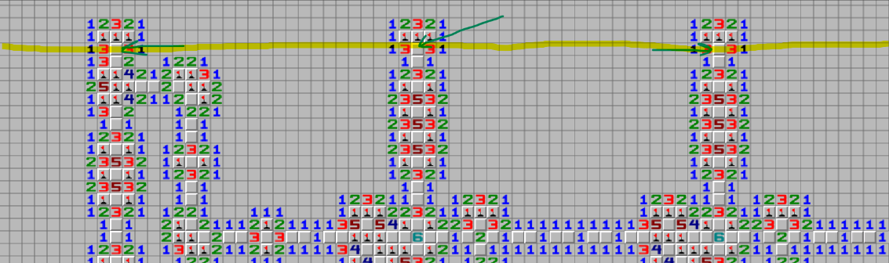
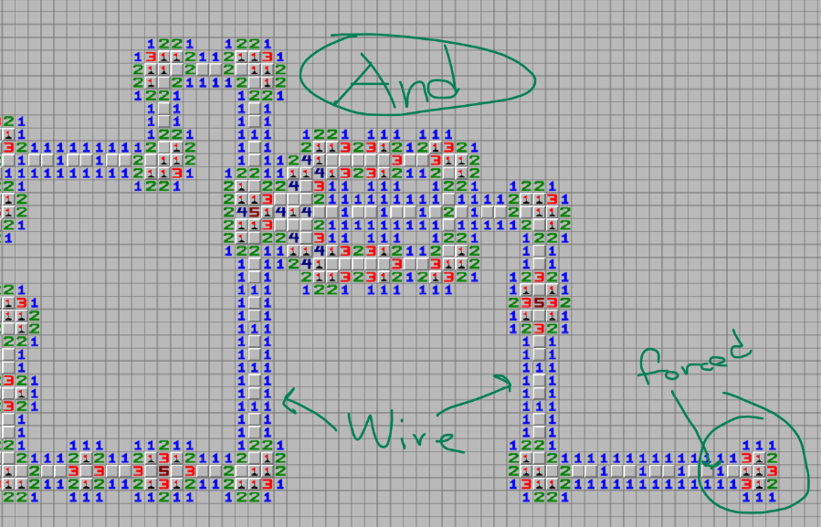

# **Mine The Gap**

## **Description**
Take a break from the other challenges and play a relxing game of Minesweeper
I have even solved most of the board for you and marked many of the mines.
I am completely sure they are correct so you just need to find the remaining ones.

Instructions:
The game client requires pygame. Navigate the board with the arrow keys.
Click an unexplored cell to toggle a flag marking a cell as containing a mine.
Already placed flags can not be removed. Every cell with a number should have
that many flags adjacent to it. Press "m" to validate the board.
The flag will appear in the console.


## **Solution**
We are provided with a game called `minesweeper.py`, which as the name suggests, is a game of minesweeper. However when trying to open the game, its clear to see that the board is MASSIVE. 

[Here](unsolved.png) is the full, unsolved minesweeper board. It probably will not load in the browser, and might take a while to load in an image viewer.


Pygame took way to long to load, so it was clear we needed to work on this in another way. Upon further inspection of `gameboard.txt`, we can see that flags are represented as `B`, and empty spaces that can be clicked on are represented as a `9`. 

Now looking back at `minesweeper.py`, we can see where the flag itself is hidden:
```py
if len(violations) == 0:
    bits = []
    for x in range(GRID_WIDTH):
        # end nodes, if its a flag then 1, else 0
        # 124 choices to make, either flag or not
        bit = 1 if validate_grid[23][x].state in [10, 11] else 0
        bits.append(bit)
    flag = hashlib.sha256(bytes(bits)).hexdigest()
    print(f'Flag: CTF{{{flag}}}')
```

The game validates our board, and then takes the hash of the 23rd row of the board which is the row highlighted below. As you can see, there are certain cells there that we can control.



One special property of this minesweeper map, is that its actually a circuit. Yep what we are trying to find then is some inputs to the circuit that make an output true. This is a quite interesting challenge, it essentially uses a reduction from the **NP Complete** problem **Circuit SAT** to **Minesweeper** and we need to solve it! 

For example, look at the final "output" of this circuit. Those long blue lines lined with `1`s are actually WIRES. You can think of it carrying a signal, either `high` or `low`, where a high signal is indicated by the top cell in each `2x1` group being a Flag, and a low signal is where the bottom cell is a Flag. Its clear to see that if you set the wire to high, it forces the entire wire to be high.




There is also the AND gate, which takes two inputs from the top left and bottom left, and will make the output high depending on those inputs.

Now in the beginning, I was hesitant to try and parse the board into a circuit because it seemed like it would have way too many edge cases, so I first wrote a spacially localized solver that iteratively checks windows and solves them. However while I thought this was quite cool and my algorithm was pretty interesting, it was unable to solve certain gates present.

My final solution ended up simply using z3. There are some 180,000 empty cells in this board, which I parsed as a variable. Then each number cell creates an equation relating the sum of certain cells. Here is the final solver.

Also [here](solved.png) is the final solved Minesweeper game :)

## Solution Code
```py
from z3 import *

with open("gameboard.txt", "r") as fin:
    circuit = fin.read()
    circuit = circuit.replace(" ", "0")
    circuit = [list(line) for line in circuit.split("\n")]

print(len(circuit), len(circuit[0]))

board = []
variable_set = set()
interest_pnt = list()
for x, line in enumerate(circuit):
    inner_row = []
    for y, cell in enumerate(line):
        if cell == "B":
            inner_row.append("B")

        elif cell == "9":
            sym_var = Int(f"C{x}_{y}")
            variable_set.add(sym_var)
            inner_row.append(sym_var)

        elif cell != "0":
            # 1-8
            interest_pnt.append((x, y))
            inner_row.append(cell)
        else:
            inner_row.append(cell)

    board.append(inner_row)

print(f"Initialized board with {len(variable_set)} variables")


def getNeighbors(i, j):
    for x in range(i - 1, i + 2):
        for y in range(j - 1, j + 2):
            if x == i and y == j:
                continue
            yield x, y


solver = Solver()
for cell in variable_set:
    solver.add(Or(cell == 0, cell == 1))

numbers_limits = set(list("12345678"))
for x, y in interest_pnt:
    value = int(board[x][y])
    dec = 0
    candidates = []
    for nx, ny in getNeighbors(x, y):
        if type(board[nx][ny]) != str:
            candidates.append(board[nx][ny])

        else:
            assert isinstance(board[nx][ny], str)
            if board[nx][ny] == "B":
                dec += 1

    if candidates:
        solver.add(Sum(candidates) == value - dec)

print("ADDED ALL EQUATIONS")

if solver.check() == sat:
    model = solver.model()
    with open("model.txt", "w") as file:
        file.write(model.sexpr())
    print(model)
    
else:
    print("unsat")
```

This solver then exports a file called `model.txt` which has the values of each cell. Finally I could parse the `model.txt` to get the flag.

```py
import re

regex_pattern = r'C23_(\d+).......\n..(.)'

with open('model.txt', 'r') as file:
    content = file.read()

result_dict = {}
matches = re.findall(regex_pattern, content)

for match in matches:
    key = int(match[0]) 
    value = int(match[1]) 
    result_dict[key] = value

bits = [0 for _ in range(3600)]

for x in result_dict:
    bits[x] = result_dict[x]

import hashlib
flag = hashlib.sha256(bytes(bits)).hexdigest()
print(f'Flag: CTF{{{flag}}}')
```


## **Flag**: *CTF{d8675fca837faa20bc0f3a7ad10e9d2682fa0c35c40872938f1d45e5ed97ab27}*
---

