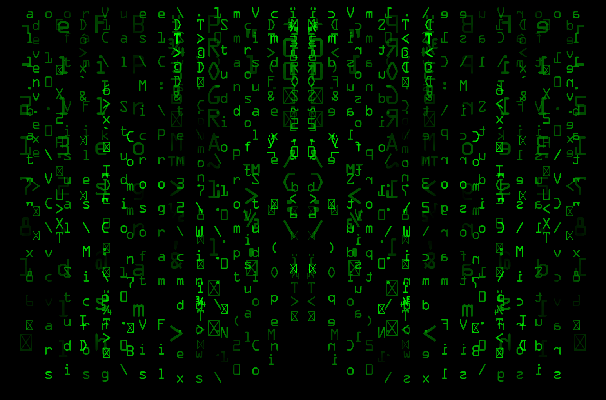

# **SYMATRIX**

## **Description**
The CIA has been tracking a group of hackers who communicate using PNG files embedded with a custom steganography algorithm. 
An insider spy was able to obtain the encoder, but it is not the original code. 
You have been tasked with reversing the encoder file and creating a decoder as soon as possible in order to read the most recent PNG file they have sent.


## **Solution**
We are given an image `symatrix.png` and a file `encoder.c`. Right off the bat, something looks strange with `encoder.c` since it seems to be a part of python source, completely unrelated to PNG or encryption. Looking closely tho, there are comments in it that hide the source code of the original `encoder.py`.

```cpp
 /* "encoder.py":29
 * print("Embedding file...")
 * 
 * bin_data = open("./flag.txt", 'rb').read()             # <<<<<<<<<<<<<<
 * data_to_hide = binascii.hexlify(bin_data).decode('utf-8')
 * 
 */
  __pyx_t_1 = __Pyx_PyObject_Call(__pyx_builtin_open, __pyx_tuple__10, NULL); if (unlikely(!__pyx_t_1)) __PYX_ERR(0, 29, __pyx_L1_error)
  __Pyx_GOTREF(__pyx_t_1);
  __pyx_t_2 = __Pyx_PyObject_GetAttrStr(__pyx_t_1, __pyx_n_s_read); if (unlikely(!__pyx_t_2)) __PYX_ERR(0, 29, __pyx_L1_error)
  __Pyx_GOTREF(__pyx_t_2);
  __Pyx_DECREF(__pyx_t_1); __pyx_t_1 = 0;
  __pyx_t_1 = __Pyx_PyObject_CallNoArg(__pyx_t_2); if (unlikely(!__pyx_t_1)) __PYX_ERR(0, 29, __pyx_L1_error)
  __Pyx_GOTREF(__pyx_t_1);
  __Pyx_DECREF(__pyx_t_2); __pyx_t_2 = 0;
  if (PyDict_SetItem(__pyx_d, __pyx_n_s_bin_data, __pyx_t_1) < 0) __PYX_ERR(0, 29, __pyx_L1_error)
  __Pyx_DECREF(__pyx_t_1); __pyx_t_1 = 0;

  /* "encoder.py":30
 * 
 * bin_data = open("./flag.txt", 'rb').read()
 * data_to_hide = binascii.hexlify(bin_data).decode('utf-8')             # <<<<<<<<<<<<<<
 * 
 * base_image = Image.open("./original.png")
 */
 ```

Using some regular expressions, I parsed all of those out, tried to piece them back together. There were a lot of repeats but here is the final recovered code:

```py
from PIL import Image
 from random import randint
 import binascii          
       
def hexstr_to_binstr(hexstr):           
    n = int(hexstr, 16)
    bstr = ''
    # this function I couldn't actually recover but its just hex to bin
    # return bin(int(hex_string, 16))[2:]

def pixel_bit(b):       
    return tuple((0, 1, b))

def embed(t1, t2): 
    return tuple((t1[0] + t2[0], t1[1] + t2[1], t1[2] + t2[2]))

def full_pixel(pixel):         
    return pixel[1] == 255 or pixel[2] == 255

bin_data = open("./flag.txt", 'rb').read()        
data_to_hide = binascii.hexlify(bin_data).decode('utf-8')
binary_string = hexstr_to_binstr(data_to_hide)

base_image = Image.open("./original.png")           


x_len, y_len = base_image.size
nx_len = x_len * 2

new_image = Image.new("RGB", (nx_len, y_len))

base_matrix = base_image.load()
new_matrix = new_image.load()

binary_string = hexstr_to_binstr(data_to_hide)
remaining_bits = len(binary_string)

nx_len = nx_len - 1
next_position = 0           

for i in range(0, y_len):
    for j in range(0, x_len):
        pixel = new_matrix[j, i] = base_matrix[j, i]            
        if remaining_bits > 0 and next_position <= 0 and not full_pixel(pixel):
            new_matrix[nx_len - j, i] = embed(pixel_bit(int(binary_string[0])),pixel)
            next_position = randint(1, 17)
            binary_string = binary_string[1:]            
            remaining_bits -= 1
        else:
            new_matrix[nx_len - j, i] = pixel           
            next_position -= 1

new_image.save("./symatrix.png")            
new_image.close()
```



It creates a new image that is twice the width of the original, and then mirrors the image pixels. However it will sometimes embed a pixel bit on the right side of the image. This gives us a pretty simple way of solving this. We just traverse the new image in the same way, and keep track of bit differences. 

```py
def pixel_bit(b):       
    return tuple((0, 1, b))
```

The pixel's `B` value will be 1 if the bit was a 1 and 0 otherwise. 

Here is the final solution:
```py
from PIL import Image

image = Image.open("symatrix.png")
matrix = image.load()

(x_len, y_len) = image.size
print(x_len, y_len)

o_len = (x_len + 1) // 2
nx_len = (o_len * 2) - 1

different_pixels = []
for i in range(y_len):
    for j in range(o_len):
        pixel = matrix[j, i]
        if matrix[nx_len - j, i] != matrix[j, i]:
            different_pixels.append((matrix[nx_len - j, i], matrix[j, i]))

for pixel_pair in different_pixels:
    print(f"{pixel_pair[0]}, {pixel_pair[1]}")

import binascii

binary_string = ''.join([str(p[0][2]) for p in different_pixels])
hex_string = hex(int(binary_string, 2))[2:]
decoded_data = binascii.unhexlify(hex_string).decode('utf-8')

print(decoded_data)
```

## **Flag**: *CTF{W4ke_Up_Ne0+Th1s_I5_Th3_Fl4g!}*
---

