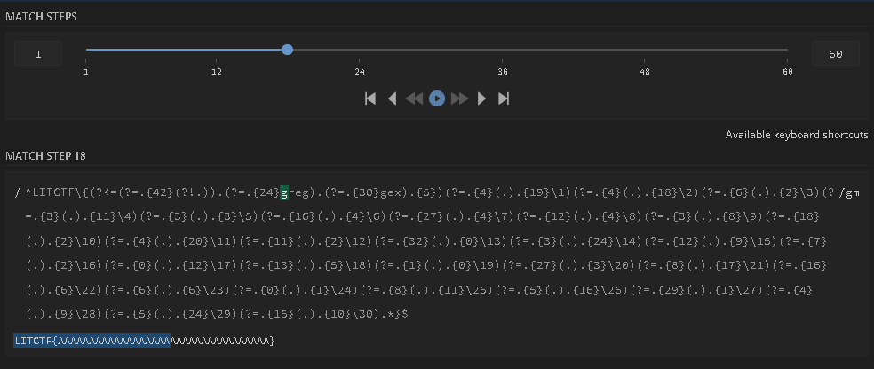

# **Fetch**
I love regex.

## **Description**
We are given a txt file that contains a regex.
```re
^LITCTF\{(?<=(?=.{42}(?!.)).(?=.{24}greg).(?=.{30}gex).{5})(?=.{4}(.).{19}\1)(?=.{4}(.).{18}\2)(?=.{6}(.).{2}\3)(?=.{3}(.).{11}\4)(?=.{3}(.).{3}\5)(?=.{16}(.).{4}\6)(?=.{27}(.).{4}\7)(?=.{12}(.).{4}\8)(?=.{3}(.).{8}\9)(?=.{18}(.).{2}\10)(?=.{4}(.).{20}\11)(?=.{11}(.).{2}\12)(?=.{32}(.).{0}\13)(?=.{3}(.).{24}\14)(?=.{12}(.).{9}\15)(?=.{7}(.).{2}\16)(?=.{0}(.).{12}\17)(?=.{13}(.).{5}\18)(?=.{1}(.).{0}\19)(?=.{27}(.).{3}\20)(?=.{8}(.).{17}\21)(?=.{16}(.).{6}\22)(?=.{6}(.).{6}\23)(?=.{0}(.).{1}\24)(?=.{8}(.).{11}\25)(?=.{5}(.).{16}\26)(?=.{29}(.).{1}\27)(?=.{4}(.).{9}\28)(?=.{5}(.).{24}\29)(?=.{15}(.).{10}\30).*}$
```

This regex uses a few not very common and relatively newer expressions in regexes. Specifically positive lookaheads and backreferences to previous capturing groups. 

We begin by checking that the flag starts with the standard flag header.
```re
^LITCTF\{
```

The first non capturing group checks that the flag is 42 characters in length.
```re
(?=.{42}(?!.))
```

We then consume the first character `L`, move forward 24 characters, and check that the following 4 characters are `greg`.
```re
.(?=.{24}greg)
```

Again we consume now the second character `A`, now move forward 30 characters, and check that the following 3 characters are `gex`.
```re
.(?=.{30}gex)
```

Then finally we consume the rest of the flag heading. `TCTF{`
```re
.{5}
```

After this setup, we now know the following about the flag. It starts with `LITCTF{` and the full flag has 42 characters. We then get a series of expressions that read 1 character from somewhere in the flag, and then checks if some later characters matches it. This creates a series of equalities throughout the flag, which will eventually be solvable to the correct flag.

For example the first such assertion is
```re
(?=.{4}(.).{19}\1)
```

This will check that the 5th character inside the flag brackets matches the 25th character. This pattern is then done throughout the rest of the regex.
## **Solution**
Since the regex was not too long, I was able to manually solve it by using the regex101 debugger, and building up the flag to keep lengthening the distance matched by the regex.

For example, I started with the flag, which matches 60 steps.
```
LITCTF{AAAAAAAAAAAAAAAAAAAAAAAAAAAAAAAAAA}
```


We can see however that it clearly fails the first check for `greg`. I then added `greg` in that position and the match was longer, however it then failed the check for `gex`.

For the backreference equalities, I would replace the `A` with numbers such as `1`, `2`, etc. Then later if a known character (something in `greg` or `gex`), matches, I would simply replace all of the same number with that character. 

Repeating this process till the end gets the flag.

---
## **Flag**: `LITCTF{rrregereeregergegegregegggexexexxx}`
---