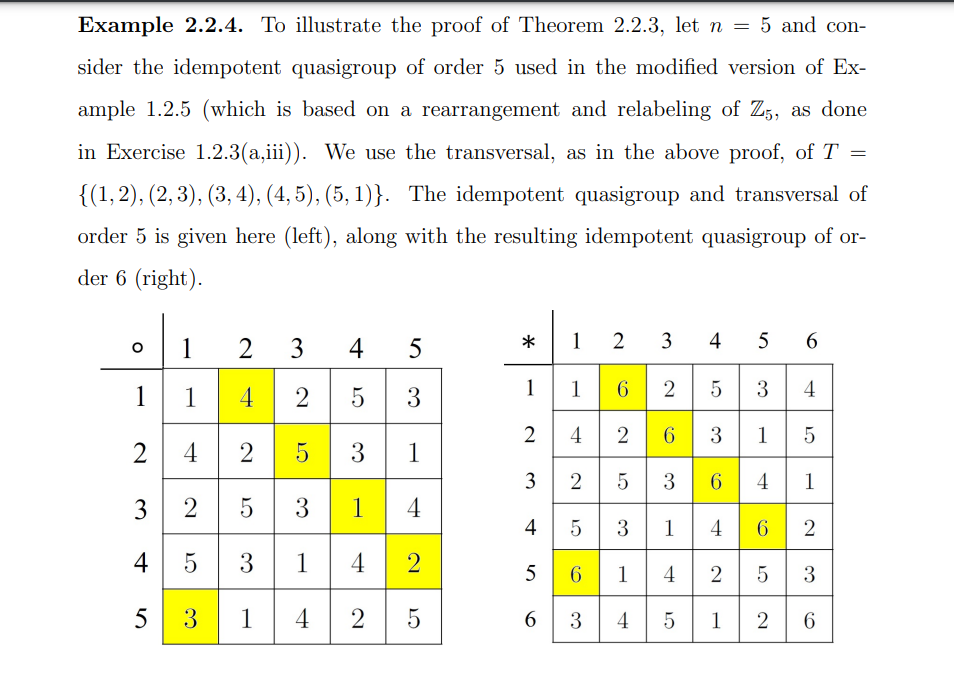

# **sudoku-revenge | 7 solves**
Let's play sudoku! For real this time...

## **Description**
The TLDR of this challenge is to generate a Latin Square of size `n` such that given a permutation `a` containing numbers from 1 to n, the `a[i]`th cell of row `i` of our board has the value `i`. This proves to be quite straightforward for boards where `n` is odd, although proves to not be as intuitive for even `n`. However we can note that this problem is equivalent to the existance of an idempotent quasigroup of order n, or in other words, there is a latin square of size n such that the main diagonal is ordered numbers 1 to n. This turns out to have a quite simple inductive proof, and this proof can be used to generate boards for even `n`.

We are given a file `sudoku-revenge.py`. The code (while not very nicely formatted), does the following:
- It generates a number `n` between 100, 200 which is the size of the board
- It then generates a list `a` with numbers from `1` to `n`, and shuffles the list
- Finally, it takes a `n`x`n` board as input, and validates that the `a[i]`th cell of row `i` of our board has the value `i`


First off, we should note that there is a simpler problem we can solve first: which is:
- Generate a Latin Square with the diagonals being `[1, n]` strictly increasing.

This works since columns of a latin square can clearly be shuffled, so we can simply shuffle each respective number into its original place. Since the `a` list is a permutation, this will always work.

Now we can try generating a Latin Square, and theres a pretty simple way to do this: 
- Create an array from [1, n]
- then repeatedly append the array rotated by 1 with wrapping.

The implementation is something like this:
```py
row = [i for i in range(1, n+1)]
m =  [row[-i:] + row[:-i] for i in range(n)]
```
Consider for example, `n = 5`:
```
|1, 2, 3, 4, 5|
|5, 1, 2, 3, 4|
|4, 5, 1, 2, 3|
|3, 4, 5, 1, 2|
|2, 3, 4, 5, 1|
```

Now as an observation, note the existance of 1, n in each row:
```
|1,  ,  ,  ,  |
| ,  , 2,  ,  |
| ,  ,  ,  , 3|
| , 4,  ,  ,  |
| ,  ,  , 5,  |
```

It seems to be in row 1, 3, 5, ..., followed by row 2, 4, 6, ..., and this ends up being true for all odd n!

But if we try this strategy on even n:
```
|1, 2, 3, 4|
|4, 1, 2, 3|
|3, 4, 1, 2|
|2, 3, 4, 1|
```
```
|1,  ,  ,  |
| ,  , 2,  |
|3,  ,  ,  |
| ,  , 4,  |
```

Unfortunately they overlap, so we cannot directly use this.

I played with this for a while, trying different patterns and so on, but it wasnt trivial. I then found [this](https://faculty.etsu.edu/gardnerr/Design-Theory/notes-Design-Theory-LR2/Design-Theory-LR2-2-2.pdf) paper.


What this exactly describes is a way to create a idempotent latin square of size n+1 from a idempotent latin square of size n. 

## **Solution**
So here is the overall idea. We can create a function called `create(n)` which creates a latin square of size n. For the odd case, its simple, we just unshuffle the rows in the way as described above.
```py

def create(n: int):
    if n % 2 == 1:
        row = [i for i in range(1, n+1)]
        m =  [row[-i:] + row[:-i] for i in range(n)]
        narr = np.array(m).T
        ret = [narr[i%n] for i in range(0, n*2, 2)]
        return np.array(ret).T.tolist()
```

Now for the even case, we use the inductive strategy. We can first get a board of size n-1, which will be odd. Then we can apply the transformation as described.
```py
    else:
        m = create(n - 1)
        l = [m[i][: i + 1] + [n] + m[i][i + 2 :] + [m[i][i + 1]] for i in range(n - 2)]
        l.append([n] + m[n - 2][1:] + [m[n - 2][0]])
        l.append(
            [
                [
                    x
                    for x in range(1, n + 1)
                    if x not in [l[x][i] for x in range(n - 1)]
                ][0]
                for i in range(n)
            ]
        )
        return l
```

Finally, whenever we get an `n` from the server, and an `a` from the server, we can compute the idempotent latin square, then unshuffle it based on the a array.
```py
p = remote(HOST, PORT)
t = int(p.recvuntil(b"\n").rstrip(b'\n').decode())

for _ in range(t):
    n = int(p.recvuntil(b"\n").rstrip(b'\n').decode())
    a = [int(x) for x in p.recvuntil(b"\n").rstrip(b'\n').decode().split(' ')]

    arr = create(n)
    print(f"n = {n}")

    t = np.array(arr).T
    arr = [None for _ in range(n)]
    for i, x in enumerate(a):
        arr[x-1] = t[i].tolist()
    mat = np.array(arr).T.tolist()

    for x in mat:
        p.sendline(' '.join(str(z) for z in x))

p.interactive()
```


---
## **Flag**: `nbctf{th1s_1s_whY_y0U_t3s7_tH3_ch3Ck3r_f1r57}`
